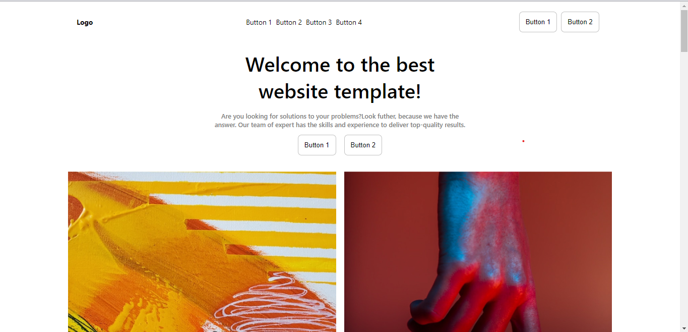
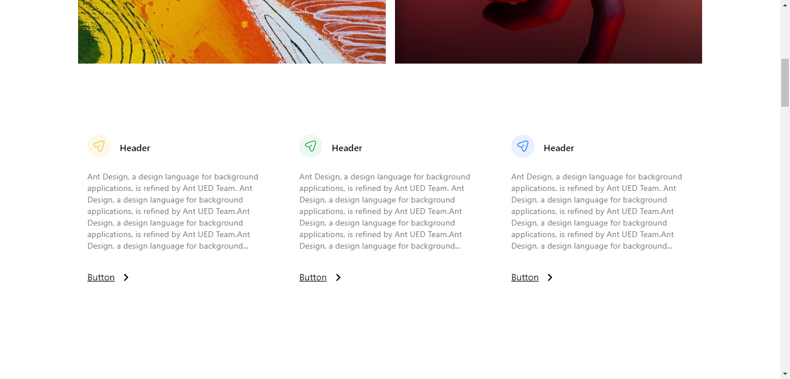
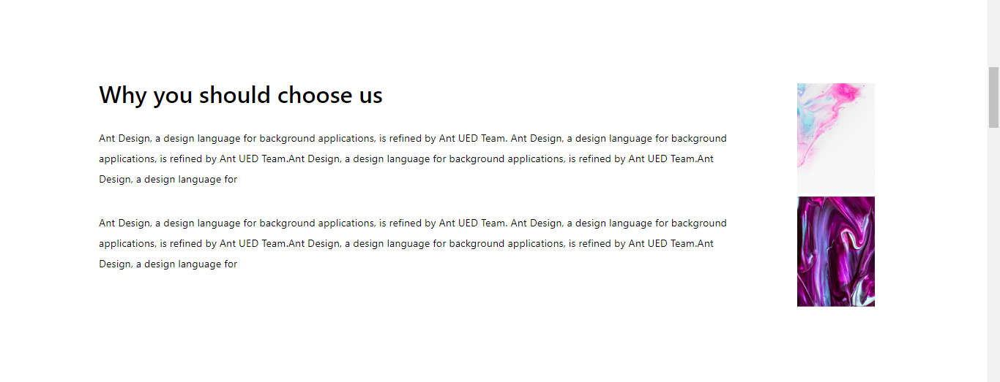
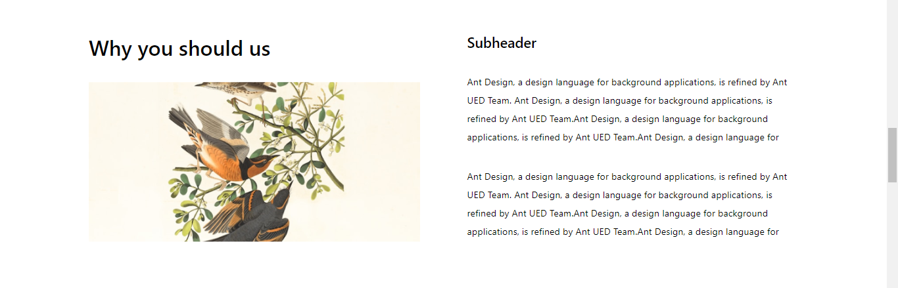
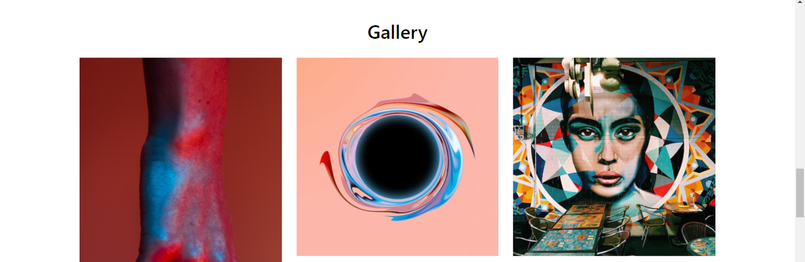
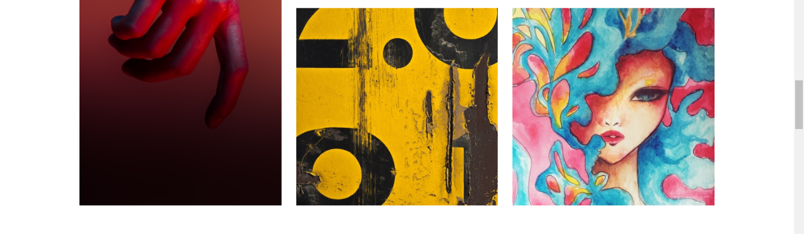
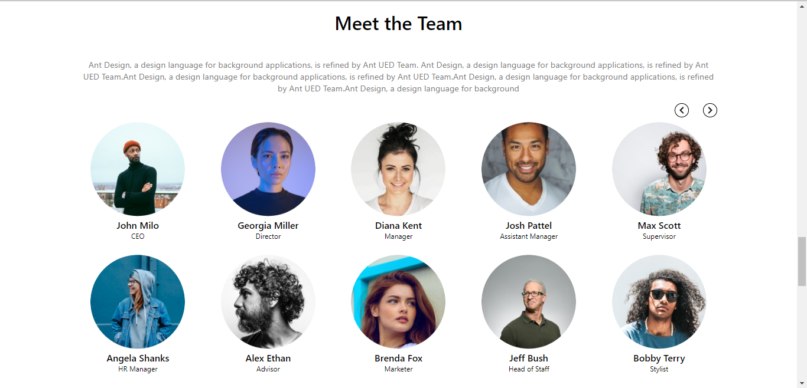
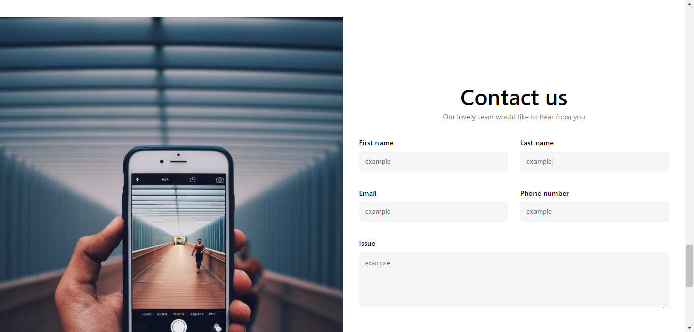
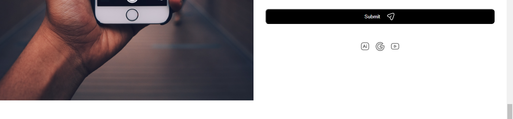
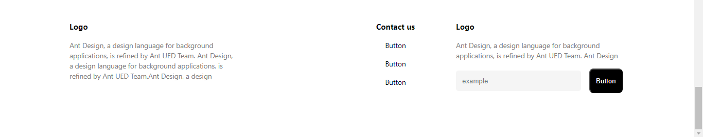

# Figma_Landing_Page

This project is a landing page design from figma using react app with full mobile responsiveness

## Getting Started

Clone or download this repository and run with a local server of open `index.html` with your favorite browser

## Prequisite

- Your browser version must be recent for a better experience

## Features

- Welcome Page
- About Page
- Gallery Page
- Meet Page
- Contact Page

## Tech/framework used

- HTML
- CSS
- ReactJS
- myreact-app
- Tailwind-CSS

## Preview

[Preview Here](https://sparkling-tartufo-5e204b.netlify.app)

## Contact

If you want to contact me you can reach me at
-wolabash@gmail.com -https://github.com/PrimeFord

## Addtional Info

- This is not meant for production. It's for learning purpose only
